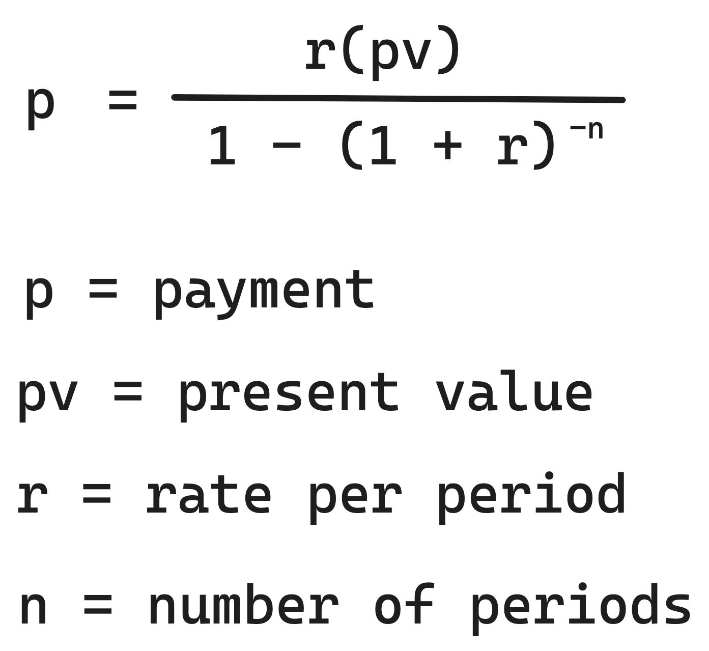

# Sinatra: Omnicalc 1

In this project, we'll learn how to get input from our users through HTML forms.

Here is our target: [omnicalc-1.matchthetarget.com](https://omnicalc-1.matchthetarget.com/)

Load the assignment and set up a codespace:

LTI{Load Sinatra Omnicalc-1 assignment}(https://grades.firstdraft.com/launch)[S9ymPy6WCsn18gLbByVbZQ7k]{vfdtzJb5bLYqYwuqgeRKpc5d}(10)[Sinatra Omnicalc-1 Project]

---

<div class="bg-blue-100 py-1 px-5" markdown="1">

[Here is a video for this lesson](https://share.descript.com/view/krwGaIMQ2mQ). You should not rely entirely on the video. Read the below lesson (and [the _Query Strings and Forms_ lesson](https://learn.firstdraft.com/lessons/102-query-strings-and-forms)) as you are going through the steps, since there are additional details in the text.

</div>

## Objectives

Here is how the app should work. As a user:

- If I visit the path **/square/new**, I should see a form with a label and an input to enter a number.
  - If I submit that form, I should see the square of the number that I entered.
- If I visit the path **/square_root/new**, I should see a form with a label and an input to enter a number.
  - If I submit that form, I should see the square root of the number that I entered.
- If I visit the path **/random/new**, I should see a form with labels and inputs to enter two numbers, a minimum and a maximum.
  - If I submit that form, I should see a random number that falls between the numbers that I entered.
- If I visit the path **/payment/new**, I should see a form with labels and inputs to enter three values:

  - The APR (annual percentage rate).
  - The number of _years_ remaining.
  - The present value.
  - If I submit that form, I should see the **monthly** payment due given the values that I entered.
  - Mind your units! Use this formula:

      <!--  -->

    

<div class="bg-blue-100 py-1 px-5" markdown="1">

**Calculating Monthly Payments: Helpful Tips**

When calculating monthly payments, it's important to keep these hints in mind:

**1. Handling APR (Annual Percentage Rate):**

- The "r" in the formula represents the interest rate per period. We take the APR(Annual Percentage Rate) as a string input, so follow these steps:
  - Convert the user input from a string to a float.
  - Divide the resulting number by 100 to convert from a percentage to a rate.
  - Since we are calculating monthly payments, divide by 12 as well.

**2. Managing the Loan Term ("n" in the Formula):**

- The "n" in the formula stands for the number of periods, which is typically provided by users in years. To adapt it for monthly payments, do the following:
  - Convert the user input from a string to an integer.
  - Multiply "n" by 12 to calculate the number of monthly periods.

**3. Variable Organization:**

- To facilitate debugging and monitoring, create two variables: one for the numerator and another for the denominator.
- If these are instance variables (i.e. `@numerator` with the leading `@`), then you can access and view them within your `.erb` view templates.
- Organizing your variables in this way will help you identify and resolve any discrepancies between your output and the target result more efficiently.

By following these steps and organizing your variables as suggested, you'll make the process of calculating monthly payments more manageable and accurate.

</div>

### Hint on Formatting

The `to_fs` (as in "format string") method can format `Floats` [in more specific ways](https://learn.firstdraft.com/lessons/33-the-one-ruby-reference#to_fs) that help us easily display data in a variety of ways. (**Note:** We already included the `require "active_support/all"` in the `config/environment.rb` file, so you can use these methods.)

In particular these two:

- [`.to_fs(:currency)`](https://learn.firstdraft.com/lessons/33-the-one-ruby-reference#currency)
- [`.to_fs(:percentage, {:precision => 4})`](https://learn.firstdraft.com/lessons/33-the-one-ruby-reference#percentage)

could be useful when formatting the output of the payment form.

<div class="bg-blue-100 py-1 px-5" markdown="1">
Use the `precision` option on the `to_fs` method to round your results. If you are confused by the usage, then please click the links above to read more about these methods.
</div>

You can compare your app against [the target app](http://omnicalc-1.matchthetarget.com/), including doing "View Source" to look at some of the static HTML.

### Valid, Accessible Forms

**In order for your tests to pass**, you must build _valid_ forms (your Chrome browser _may_ tolerate invalid forms while you are manually testing, but automated test suites reject invalid forms):

- Each `<input>` in the form must have a unique `id=""` attribute.
- The `<label>` associated with the `<input>` should have a `for=""` attribute that matches the value of the `<input>`'s `id`.
- The copy within the `<label>` must exactly match the target — spelling, capitalization, and punctuation matter for labels.
- The same goes for the copy on the button to submit the form.
- Any invalid HTML within a form will cause the test to fail, e.g. an orphaned closing `</div>` tag. Keep your code neatly indented to help avoid this.

An example of a valid form; in particular, notice the `id=""` and `for=""` attributes:

```erb{3:(12-26),7:(12-25),11:(12-26),15:(12-25)}
<form action="/random/results">
  <div>
    <label for="min_input">
      Minimum
    </label>

    <input id="min_input" type="text" name="user_min" placeholder="E.g. 1.5">
  </div>

  <div>
    <label for="max_input">
      Maximum
    </label>

    <input id="max_input" type="text" name="user_max" placeholder="E.g. 4.5">
  </div>

  <button>
    Pick random number
  </button>
</form>
```

---

- Approximately how long (in minutes) did this lesson take you to complete?
{: .free_text_number #time_taken title="Time taken" points="1" answer="any" }

---
